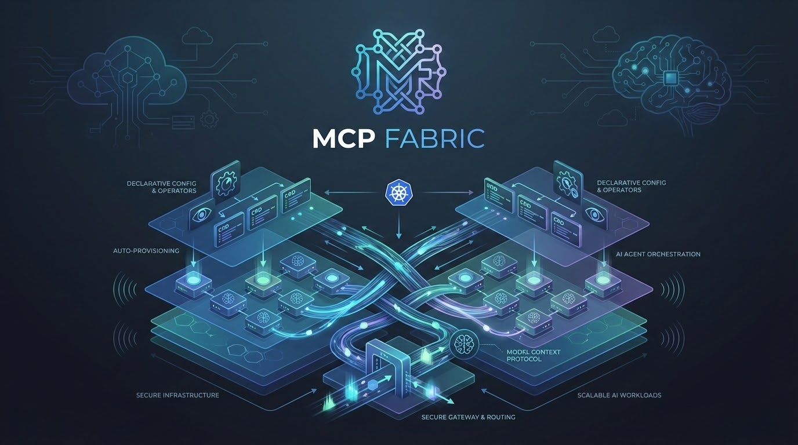

# MCP Fabric

A Kubernetes-native platform for deploying and managing AI agents declaratively using Custom Resource Definitions (CRDs).



## Overview

MCP Fabric enables you to define AI agents as Kubernetes resources. The operator automatically provisions all necessary infrastructure including Deployments, Services, ConfigMaps, and NetworkPolicies with security hardening built-in.

```
┌──────────────────────────────────────────────────────────────────┐
│                      MCP Fabric Framework                        │
├──────────────────────────────────────────────────────────────────┤
│  ┌─────────────┐     watches      ┌────────────────────────────┐ │
│  │  Operator   │ ───────────────► │ Agent/Route/Tool/Task CRs  │ │
│  └─────────────┘                  └────────────────────────────┘ │
│         │ creates                                                │
│         ▼                                                        │
│  ┌────────────────────────────────────────────────────────────┐  │
│  │              Agent Deployments & Task Jobs                 │  │
│  └────────────────────────────────────────────────────────────┘  │
│         ▲                                                        │
│         │ routes requests                                        │
│  ┌─────────────┐                                                 │
│  │   Gateway   │ ◄──── HTTP/MCP ────── Clients                   │
│  └─────────────┘                                                 │
└──────────────────────────────────────────────────────────────────┘
```

## Features

- **Declarative Agent Definition**: Define agents with system prompts, model configuration, and tool access using CRDs
- **Autonomous Task Execution**: Run multi-step AI tasks with orchestration, progress tracking, and quality gates
- **Git Integration**: Clone repositories, commit changes, and create PRs automatically from Tasks
- **Automatic Infrastructure**: Operator creates Deployments, Services, ConfigMaps, and NetworkPolicies
- **Security by Default**: Non-root containers, read-only filesystems, dropped capabilities, network isolation
- **Flexible Routing**: Route requests to agents by name or intent-based regex matching
- **Tool Packages**: Bundle Python tools into OCI images and reference them from agents
- **MCP Protocol Support**: Native Model Context Protocol integration

## Components

| Component | Description |
|-----------|-------------|
| **Operator** | Kubernetes controller that watches Agent/Route/Tool/Task CRs and manages resources |
| **Gateway** | HTTP API server that routes requests to appropriate agent pods |
| **Agent Runtime** | Python-based agent execution environment (see examples) |
| **Task** | Autonomous execution loop that orchestrates agents to complete multi-step work with Git integration |

## Quick Start

### Prerequisites

- Kubernetes cluster (1.28+)
- kubectl configured
- AWS credentials for Bedrock access (or alternative LLM provider)

### Installation

```bash
# Install CRDs
kubectl apply -f operator/config/crd/bases/

# Deploy operator
kubectl apply -k deploy/kustomize/base/operator/

# Deploy gateway
kubectl apply -k deploy/kustomize/base/gateway/
```

### Create Your First Agent

```yaml
apiVersion: fabric.jarsater.ai/v1alpha1
kind: Agent
metadata:
  name: my-assistant
  namespace: mcp-fabric-agents
spec:
  prompt: |
    You are a helpful assistant.
  model:
    provider: bedrock
    modelId: eu.anthropic.claude-3-7-sonnet-20250219-v1:0
    maxTokens: 4096
  envFrom:
    - secretRef:
        name: aws-bedrock-credentials
```

```bash
kubectl apply -f my-agent.yaml
```

### Invoke the Agent

```bash
curl -X POST http://agent-gateway:8080/v1/invoke \
  -H "Content-Type: application/json" \
  -d '{
    "agent": "my-assistant",
    "query": "Hello, how can you help me?"
  }'
```

### Create an Autonomous Task

Tasks enable multi-step AI workflows with Git integration and quality gates:

```yaml
apiVersion: fabric.jarsater.ai/v1alpha1
kind: Task
metadata:
  name: implement-feature
  namespace: mcp-fabric-agents
spec:
  workerRef:
    name: code-worker
  taskSource:
    type: configmap
    configMapRef:
      name: feature-prd
      key: tasks.json
  git:
    url: https://github.com/myorg/myrepo.git
    branch: feat/new-feature
    baseBranch: main
    credentialsSecret:
      name: github-credentials
    createPR: true
  qualityGates:
    - name: test
      command: ["npm", "test"]
  limits:
    maxIterations: 50
    totalTimeout: 4h
```

```bash
kubectl apply -f my-task.yaml

# Monitor progress
kubectl get tasks -w
```

## Documentation

| Document | Description |
|----------|-------------|
| [Getting Started](docs/getting-started.md) | Complete setup and first agent walkthrough |
| [Architecture](docs/architecture.md) | System design, components, and patterns |
| [Writing Agents](docs/writing-agents.md) | Guide to building custom agents |
| [Writing Tools](docs/writing-tools.md) | Guide to building tool packages |
| [API Reference](docs/CRD-REFERENCE.md) | Complete CRD specification reference |
| [Metrics](METRICS.md) | Prometheus metrics and observability |
| [Troubleshooting](docs/TROUBLESHOOTING.md) | Common issues and solutions |

## Examples

The `examples/` directory contains reference implementations demonstrating how to build agents, tools, and shared libraries:

```
examples/
├── agents/              # Example agent implementations
│   ├── default/         # Default agent runner
│   ├── task-orchestrator/  # Task orchestration agent
│   └── code-worker/     # Code implementation worker
├── tools/               # Example tool packages
├── libs/                # Shared libraries for agents
└── deploy/              # Sample Kubernetes manifests
    └── tasks/           # Task CR examples
```

See [examples/README.md](examples/README.md) for details.

## Building

```bash
# Build operator and gateway
make docker-build

# Build example agents and tools
make examples
```

## Development

See [DEVELOPMENT.md](DEVELOPMENT.md) for local development setup with Kind.

## Contributing

See [CONTRIBUTING.md](CONTRIBUTING.md) for guidelines.

## Security

See [SECURITY.md](SECURITY.md) for security policy and vulnerability reporting.

## License

This project is licensed under the Apache License 2.0 - see [LICENSE](LICENSE) for details.
