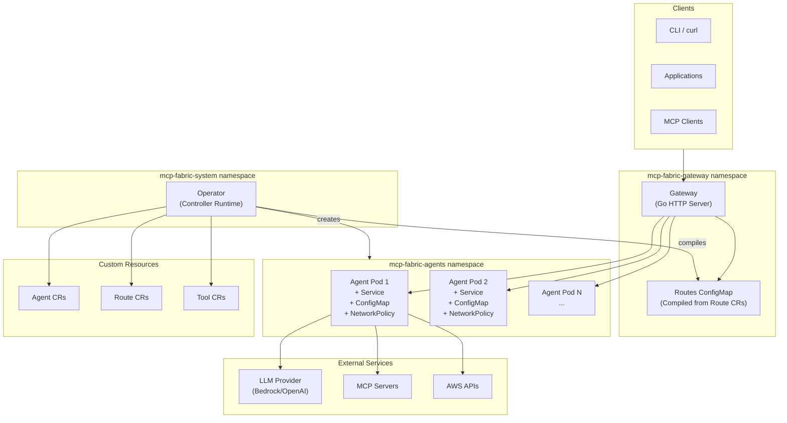
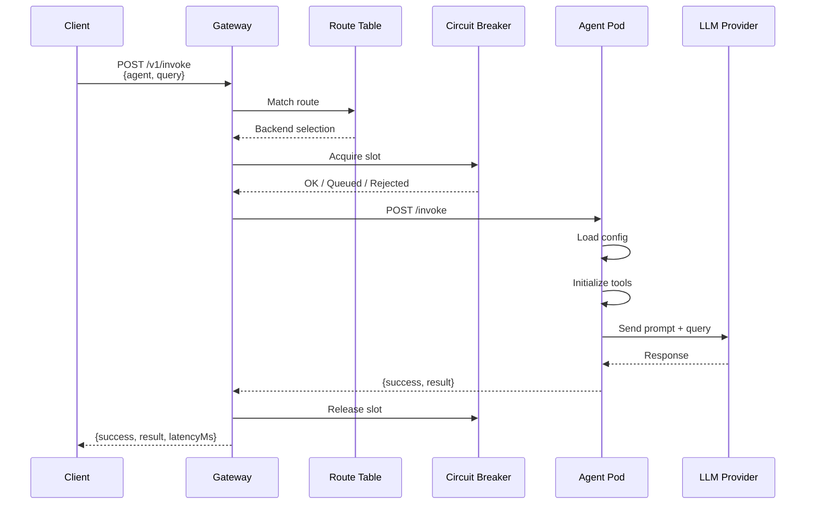
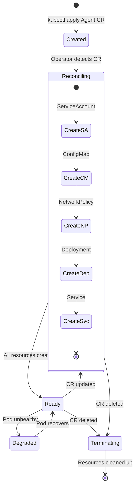
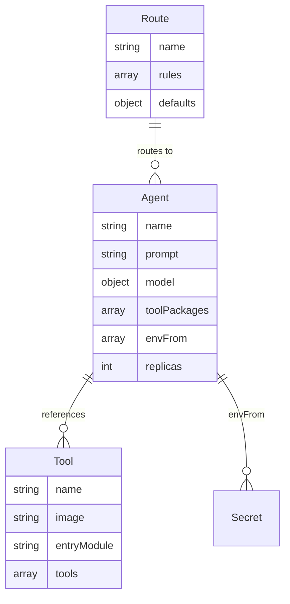
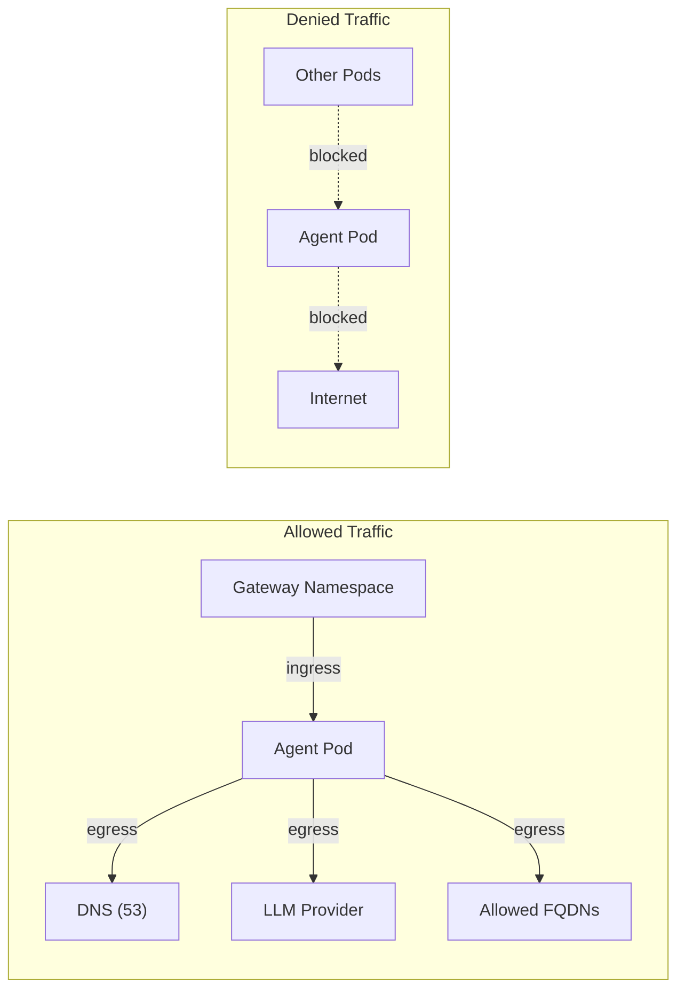
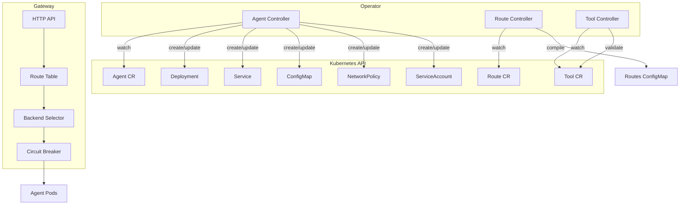

# Architecture Diagrams

## System Overview

```mermaid
flowchart TB
    subgraph clients["Clients"]
        cli["CLI / curl"]
        app["Applications"]
        mcp["MCP Clients"]
    end

    subgraph gateway_ns["mcp-fabric-gateway namespace"]
        gw["Gateway<br/>(Go HTTP Server)"]
        routes_cm["Routes ConfigMap<br/>(Compiled from Route CRs)"]
    end

    subgraph system_ns["mcp-fabric-system namespace"]
        op["Operator<br/>(Controller Runtime)"]
    end

    subgraph agents_ns["mcp-fabric-agents namespace"]
        agent1["Agent Pod 1<br/>+ Service<br/>+ ConfigMap<br/>+ NetworkPolicy"]
        agent2["Agent Pod 2<br/>+ Service<br/>+ ConfigMap<br/>+ NetworkPolicy"]
        agent3["Agent Pod N<br/>..."]
    end

    subgraph crds["Custom Resources"]
        agent_cr["Agent CRs"]
        route_cr["Route CRs"]
        tool_cr["Tool CRs"]
    end

    subgraph external["External Services"]
        llm["LLM Provider<br/>(Bedrock/OpenAI)"]
        mcp_server["MCP Servers"]
        aws["AWS APIs"]
    end

    clients --> gw
    gw --> routes_cm
    gw --> agent1
    gw --> agent2
    gw --> agent3

    op --> agent_cr
    op --> route_cr
    op --> tool_cr
    op --> |creates| agents_ns
    op --> |compiles| routes_cm

    agent1 --> llm
    agent1 --> mcp_server
    agent1 --> aws
```

## Request Flow

```mermaid
sequenceDiagram
    participant C as Client
    participant G as Gateway
    participant RT as Route Table
    participant CB as Circuit Breaker
    participant A as Agent Pod
    participant LLM as LLM Provider

    C->>G: POST /v1/invoke<br/>{agent, query}
    G->>RT: Match route
    RT-->>G: Backend selection
    G->>CB: Acquire slot
    CB-->>G: OK / Queued / Rejected
    G->>A: POST /invoke
    A->>A: Load config
    A->>A: Initialize tools
    A->>LLM: Send prompt + query
    LLM-->>A: Response
    A-->>G: {success, result}
    G->>CB: Release slot
    G-->>C: {success, result, latencyMs}
```

## Agent Lifecycle

```mermaid
stateDiagram-v2
    [*] --> Created: kubectl apply Agent CR
    Created --> Reconciling: Operator detects CR
    Reconciling --> Ready: All resources created
    Ready --> Reconciling: CR updated
    Ready --> Degraded: Pod unhealthy
    Degraded --> Ready: Pod recovers
    Ready --> Terminating: CR deleted
    Reconciling --> Terminating: CR deleted
    Terminating --> [*]: Resources cleaned up

    state Reconciling {
        [*] --> CreateSA: ServiceAccount
        CreateSA --> CreateCM: ConfigMap
        CreateCM --> CreateNP: NetworkPolicy
        CreateNP --> CreateDep: Deployment
        CreateDep --> CreateSvc: Service
        CreateSvc --> [*]
    }
```

## CRD Relationships

```mermaid
erDiagram
    Agent ||--o{ Tool : references
    Agent ||--o{ Secret : "envFrom"
    Route ||--o{ Agent : "routes to"

    Agent {
        string name
        string prompt
        object model
        array toolPackages
        array envFrom
        int replicas
    }

    Route {
        string name
        array rules
        object defaults
    }

    Tool {
        string name
        string image
        string entryModule
        array tools
    }
```

## Network Policy

```mermaid
flowchart LR
    subgraph allowed["Allowed Traffic"]
        direction TB
        gw_ns["Gateway Namespace"] -->|ingress| agent["Agent Pod"]
        agent -->|egress| dns["DNS (53)"]
        agent -->|egress| llm["LLM Provider"]
        agent -->|egress| fqdn["Allowed FQDNs"]
    end

    subgraph denied["Denied Traffic"]
        direction TB
        other["Other Pods"] -.->|blocked| agent2["Agent Pod"]
        agent2 -.->|blocked| internet["Internet"]
    end
```

## Component Interactions

```mermaid
flowchart TB
    subgraph operator["Operator"]
        ac["Agent Controller"]
        rc["Route Controller"]
        tc["Tool Controller"]
    end

    subgraph k8s["Kubernetes API"]
        agent_cr["Agent CR"]
        route_cr["Route CR"]
        tool_cr["Tool CR"]
        dep["Deployment"]
        svc["Service"]
        cm["ConfigMap"]
        np["NetworkPolicy"]
        sa["ServiceAccount"]
    end

    subgraph gateway["Gateway"]
        api["HTTP API"]
        rt["Route Table"]
        sel["Backend Selector"]
        cb["Circuit Breaker"]
    end

    ac -->|watch| agent_cr
    ac -->|create/update| dep
    ac -->|create/update| svc
    ac -->|create/update| cm
    ac -->|create/update| np
    ac -->|create/update| sa

    rc -->|watch| route_cr
    rc -->|compile| routes_cm["Routes ConfigMap"]

    tc -->|watch| tool_cr
    tc -->|validate| tool_cr

    api --> rt
    rt --> sel
    sel --> cb
    cb --> agents["Agent Pods"]
```
